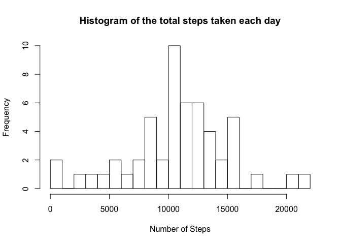
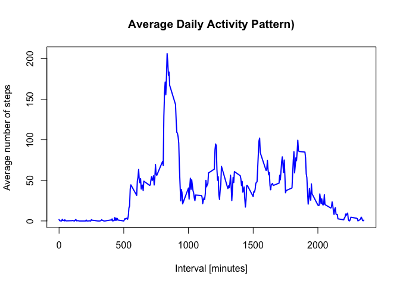
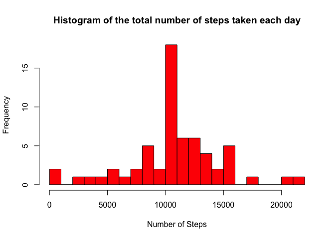
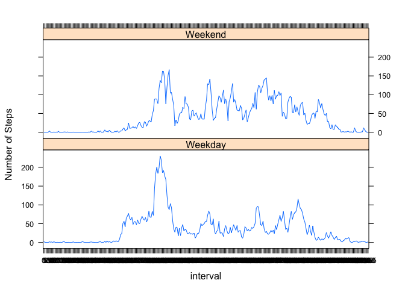

# Analysis of Activity Monitoring Device


###Introduction

It is now possible to collect a large amount of data about personal movement using activity monitoring devices such as a Fitbit, Nike Fuelband, or Jawbone Up. These type of devices are part of the “quantified self” movement – a group of enthusiasts who take measurements about themselves regularly to improve their health, to find patterns in their behavior, or because they are tech geeks. But these data remain under-utilized both because the raw data are hard to obtain and there is a lack of statistical methods and software for processing and interpreting the data.

This assignment makes use of data from a personal activity monitoring device. This device collects data at 5 minute intervals through out the day. The data consists of two months of data from an anonymous individual collected during the months of October and November, 2012 and include the number of steps taken in 5 minute intervals each day. Data was provided for the course students for this particular assignment, avaliable to download via this [link](https://d396qusza40orc.cloudfront.net/repdata%2Fdata%2Factivity.zip) (avaliable at 2014-05-25)

Lets analyse the data and try to answer the following questions:

1. What is mean total number of steps taken per day?
2. What is the average daily activity pattern?
3. Are there differences in activity patterns between weekdays and weekends?

 Download the file and unzip

```r
# setwd("~/workspace/repdata_prj1")

if(!file.exists("activity.csv"))
{ download.file("https://d396qusza40orc.cloudfront.net/repdata%2Fdata%2Factivity.zip",destfile="activity.zip")
  
  # Unzip to create household_power_consumption.txt file
  unzip(zipfile="activity.zip")
}
```
 Read activity file contents

```r
actdata <- read.csv('activity.csv', stringsAsFactors=FALSE,header = TRUE, sep = ",",colClasses=c("numeric", "character", "numeric"))
actdata$date <- as.Date(actdata$date, "%Y-%m-%d")
#actdata$interval <- factor(actdata$interval)
```

## 1. What is mean total number of steps taken per day?
a. Extract date and aggregated steps for each date in to daily_steps

```r
daily_steps <-  aggregate(steps ~ date, actdata, sum)
# Add column names
colnames(daily_steps) <- c("date","steps")
```

b. Plot Histogram of Total steps and for each day

```r
hist(daily_steps$steps, breaks = 20, xlab = "Number of Steps", main= "Histogram of the total steps taken each day")
```

<!-- -->
</br>d. Find Mean & Median

```r
#Mean
mean(daily_steps$steps)
```

```
## [1] 10766.19
```


```r
#Median
mean(daily_steps$steps)
```

```
## [1] 10766.19
```

## 2. What is the average daily activity pattern?
a. Find Average steps across all days

```r
#Calculating the average
steps_per_interval <- aggregate(actdata$steps, by=list(actdata$interval), FUN=mean, na.rm=TRUE)
#Adding columns names
colnames(steps_per_interval) <- c("interval", "avg_steps")

#ploting the average daily activity pattern 
plot(steps_per_interval$interval, steps_per_interval$avg_steps, type="l", col="blue", lwd=2, xlab="Interval [minutes]", ylab="Average number of steps", main="Average Daily Activity Pattern)")
```

<!-- -->
</br>b.Which 5-minute interval, on average across all the days in the dataset, contains the maximum number of steps?

```r
# Maximum number of average steps 
max(steps_per_interval$avg_steps)
```

```
## [1] 206.1698
```

```r
#The 5-minute interval that has the maximum number of steps
steps_per_interval[which.max(steps_per_interval$avg_steps),]$interval
```

```
## [1] 835
```

```r
#rm(steps_per_interval)
```
The Interval 835 got the maximum steps 206.16

##3.Imputing missing values
a. Total missing values in the dataset

```r
sum(is.na(actdata$steps))
```

```
## [1] 2304
```
b. Fill missing values with 0

```r
NA_index <- which(is.na(as.character(actdata$steps)))
actdata_nona <- actdata

actdata_nona[NA_index, ]$steps<-unlist(lapply(NA_index, FUN=function(NA_index) {steps_per_interval[actdata[NA_index,]$interval ==steps_per_interval$interval,]$avg_steps}))

actdata_nona$interval <- factor(actdata_nona$interval)
```

c. Histogram of the total number of steps taken each day

```r
#Extract steps taken for each day
steps_each_day <- aggregate(steps ~ date, data = actdata_nona, sum)
#Adding column names to the created data frame
colnames(steps_each_day) <- c("date", "steps")

#Making the histogram
hist(steps_each_day$steps, breaks = 20, col = "red", xlab = "Number of Steps", main= "Histogram of the total number of steps taken each day")
```

<!-- -->
</br>d. Calculate and report the mean and median total number of steps taken per day.

```r
#Mean
mean(steps_each_day$steps)
```

```
## [1] 10766.19
```


```r
#Median
median(steps_each_day$steps)
```

```
## [1] 10766.19
```

##4. Are there differences in activity patterns between weekdays and weekends?
Classify data into week day and weekend

```r
actdata_nona$day <- as.factor(weekdays(actdata_nona$date))
#Creating a logical variable "is_weekday" (weekday=TRUE, weekend = FALE) :
#actdata_nona$is_weekday <- ifelse(!(as.factor(weekdays(actdata_nona$date)) %in% c("Saturday","Sunday")), TRUE, FALSE) 

actdata_nona$is_weekday <- ifelse(!(actdata_nona$day %in% c("Saturday","Sunday")), TRUE, FALSE) 

#Find Average steps for weekdays
steps_weekdays <- aggregate(actdata_nona[actdata_nona$is_weekday,]$steps, by=list(interval=actdata_nona[actdata_nona$is_weekday,]$interval), FUN=mean)
colnames(steps_weekdays) <- c("interval", "average_steps")
steps_weekdays$day <- "Weekday"

#Find Average steps for weekend
steps_weekend <- aggregate(actdata_nona[!actdata_nona$is_weekday,]$steps, by=list(interval=actdata_nona[!actdata_nona$is_weekday,]$interval), FUN=mean)
colnames(steps_weekend) <- c("interval", "average_steps")
steps_weekend$day <- "Weekend"

#combine to form complete week
week_data <- rbind(steps_weekdays, steps_weekend)
week_data$day <- as.factor(week_data$day)

#Making the plot
library(lattice)
xyplot(average_steps ~  interval | day, data = week_data, layout = c(1,2), type ="l", ylab="Number of Steps")
```

<!-- -->
</br>It is observed from the plot that activity on the weekends tends to be more spread out over the day compared to the weekdays.

```r
# Clear the workspace
 rm(list=ls())
```

